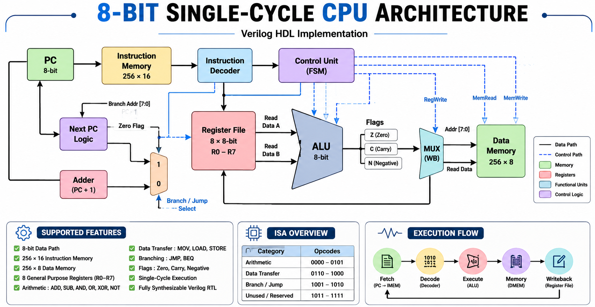
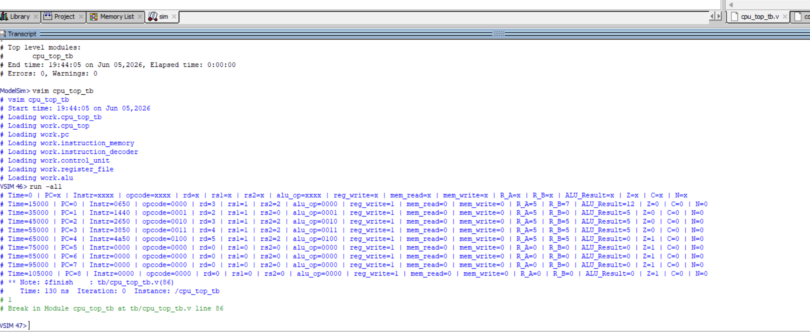
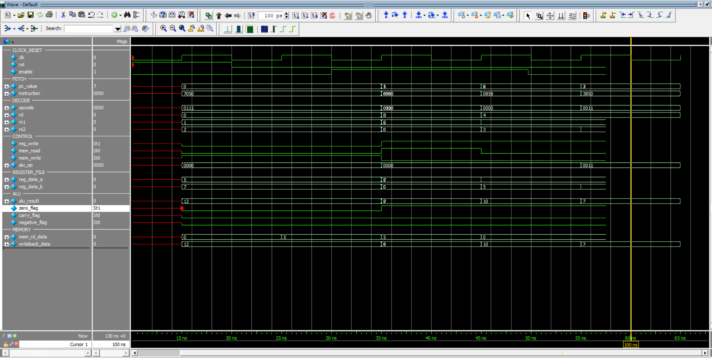
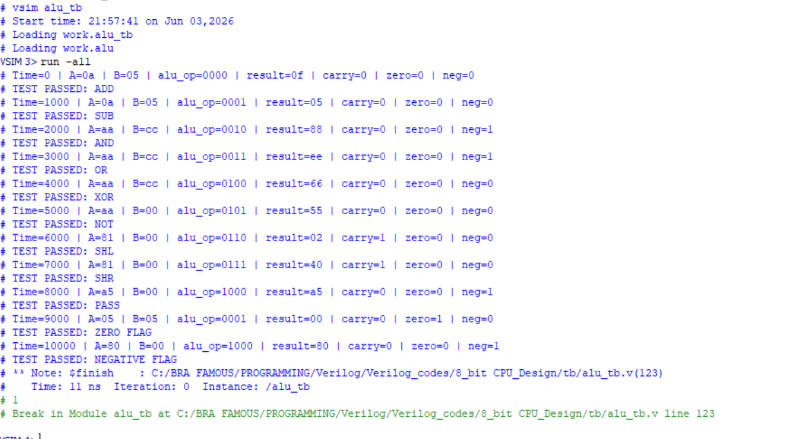
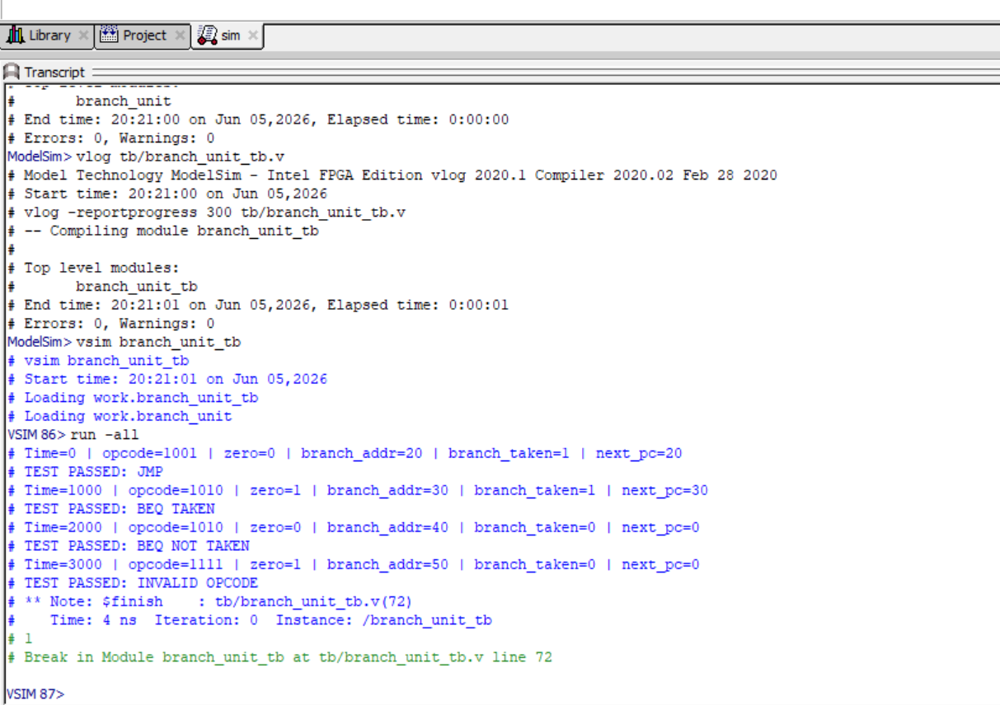

# Design and Verification of an 8-Bit Single-Cycle CPU in Verilog HDL


## Abstract

This project presents the design and functional verification of an 8-bit single-cycle CPU implemented in Verilog HDL. The CPU is built using a modular bottom-up design method, where each hardware block is designed and verified independently before being integrated into a complete processor datapath.

The processor includes an 8-bit program counter, 256 x 16-bit instruction memory, instruction decoder, control unit, 8 x 8 register file, ALU, 256 x 8-bit data memory, writeback mux, and branch unit. Verification was performed in ModelSim using directed testbenches, waveform inspection, and transcript-based PASS/FAIL checks.

## 1. Introduction

A central processing unit is a digital system that fetches instructions, decodes them, executes arithmetic or logical operations, accesses memory when required, and writes results back into registers. This project implements a compact educational CPU that demonstrates those core processor operations using synthesizable Verilog modules.

The objective of this project was to design a complete 8-bit CPU datapath and verify that data can move correctly through the following paths:

- Register file to data memory using STORE
- Data memory back to register file using LOAD
- Register file through ALU back to register file using ADD and logic instructions
- Branch decision logic using JMP and BEQ test cases

The project follows an IEEE-style engineering flow: requirements, RTL design, modular verification, integrated CPU verification, waveform capture, and results documentation.

## 2. Project Structure

```text
8_bit CPU_Design/
|-- rtl/
|   |-- pc.v
|   |-- instruction_memory.v
|   |-- instruction_decoder.v
|   |-- control_unit.v
|   |-- register_file.v
|   |-- alu.v
|   |-- data_memory.v
|   |-- branch_unit.v
|   |-- cpu_top.v
|   |-- CPU_instruction_set.txt
|   `-- pc_notes.txt
|
|-- tb/
|   |-- pc_tb.v
|   |-- instruction_memory_tb.v
|   |-- instruction_decoder_tb.v
|   |-- register_file_tb.v
|   |-- alu_tb.v
|   |-- data_memory_tb.v
|   |-- control_unit_tb.v
|   |-- branch_unit_tb.v
|   `-- cpu_top_tb.v
|
|-- script/
|   `-- run_cpu_waveform.tcl
|
|-- Task/
|   |-- CPU_Project_Requirement_Plan.pdf
|   `-- Project_Plan.png
|
|-- results/
|   |-- alu_tb.png
|   |-- control_unit_tb.png
|   |-- cpu_top_tb.png
|   |-- data_memory_tb.png
|   |-- instruction_memory_tb.png
|   `-- register_file_tb.png
|
|-- readme_resources/
|   |-- 8bit_cpu_project_transcript.txt
|   |-- cpu_architecture.png
|   |-- cpu_execution.png
|   |-- cpu_waveform.png
|   |-- alu_test.png
|   `-- branch_test.png
|
|-- 8_bit CPU.mpf
|-- 8_bit CPU.cr.mti
`-- README.md
```

## 3. CPU Design Specification

The CPU is designed as an 8-bit processor with a 16-bit instruction word. The datapath is organized around a program counter, instruction memory, decoder, control unit, register file, ALU, data memory, and writeback mux.

| Feature | Specification |
|---|---|
| Data width | 8 bits |
| Program counter width | 8 bits |
| Instruction width | 16 bits |
| Instruction memory | 256 x 16-bit |
| Data memory | 256 x 8-bit |
| Register file | 8 registers, 8 bits each |
| Register addressing | 3 bits |
| ALU operation width | 4 bits |
| Verification tool | ModelSim / QuestaSim |
| Design style | Modular Verilog RTL |

### Top-Level Interface

The integrated CPU is implemented in `rtl/cpu_top.v`.

| Signal | Direction | Width | Description |
|---|---:|---:|---|
| `clk` | Input | 1 | System clock |
| `rst` | Input | 1 | Active-high reset |
| `enable` | Input | 1 | Enables program counter advancement |
| `pc_value` | Output | 8 | Current program counter value |
| `instruction` | Output | 16 | Instruction fetched from instruction memory |
| `opcode` | Output | 4 | Decoded instruction opcode |
| `rd` | Output | 3 | Destination register field |
| `rs1` | Output | 3 | First source register field |
| `rs2` | Output | 3 | Second source register field |
| `alu_op` | Output | 4 | ALU operation selected by the control unit |
| `reg_write` | Output | 1 | Register file write enable |
| `mem_read` | Output | 1 | Data memory read control |
| `mem_write` | Output | 1 | Data memory write enable |
| `reg_data_a` | Output | 8 | Register file read port A data |
| `reg_data_b` | Output | 8 | Register file read port B data |
| `alu_result` | Output | 8 | ALU result |
| `zero_flag` | Output | 1 | Asserted when ALU result is zero |
| `carry_flag` | Output | 1 | Carry or shift-out flag |
| `negative_flag` | Output | 1 | MSB of ALU result |
| `mem_rd_data` | Output | 8 | Data memory read value |
| `writeback_data` | Output | 8 | Value written back to the register file |

## 4. CPU Architecture

The CPU executes instructions using the datapath shown below.



The high-level datapath is:

```text
PC -> Instruction Memory -> Instruction Decoder -> Control Unit
                                      |
                                      v
Register File -> ALU -> Writeback Mux -> Register File
      |           |
      |           v
      +------> Data Memory
```

The writeback mux selects between ALU output and data memory output:

```verilog
assign writeback_data = mem_read ? mem_rd_data : alu_result;
```

This allows arithmetic and logic instructions to write ALU results into the register file, while LOAD instructions write memory data into the register file.

## 5. Instruction Format and Instruction Set

Each instruction is 16 bits wide and is divided into opcode, destination register, source register 1, source register 2, and unused bits.

```text
15      12 11      9 8       6 5       3 2       0
+---------+---------+---------+---------+---------+
| Opcode  |   Rd    |   Rs1   |   Rs2   | Unused  |
+---------+---------+---------+---------+---------+
  4 bits    3 bits    3 bits    3 bits    3 bits
```

| Opcode | Instruction | Operation |
|---|---|---|
| `0000` | ADD | `Rd = Rs1 + Rs2` |
| `0001` | SUB | `Rd = Rs1 - Rs2` |
| `0010` | AND | `Rd = Rs1 & Rs2` |
| `0011` | OR | `Rd = Rs1 \| Rs2` |
| `0100` | XOR | `Rd = Rs1 ^ Rs2` |
| `0101` | NOT | `Rd = ~Rs1` |
| `0110` | LOAD | `Rd = Memory[address]` |
| `0111` | STORE | `Memory[address] = Rs1` |
| `1000` | MOV | `Rd = Rs1` |
| `1001` | JMP | Branch unit unconditional jump |
| `1010` | BEQ | Branch unit conditional branch when zero flag is high |

The main integrated CPU datapath currently verifies arithmetic, logic, LOAD, STORE, and MOV-style writeback behavior. JMP and BEQ are implemented and verified in the standalone branch unit testbench.

## 6. RTL Module Descriptions

### 6.1 Program Counter

File: `rtl/pc.v`

The program counter is an 8-bit sequential register. On reset, it returns to zero. When `enable` is asserted, it increments by one on each rising clock edge.

Key behavior:

- Active-high reset
- Enable-controlled increment
- Parameterized width
- Provides the instruction memory address

### 6.2 Instruction Memory

File: `rtl/instruction_memory.v`

The instruction memory is a 256 x 16-bit ROM-style module with asynchronous read behavior. It is initialized with a short CPU program used for integrated verification.

Program loaded into memory:

```verilog
memory[0] = 16'b0111_000_001_010_000; // STORE R1 -> Memory[R2]
memory[1] = 16'b0110_011_010_000_000; // LOAD  R3 <- Memory[R2]
memory[2] = 16'b0000_100_001_011_000; // ADD   R4 = R1 + R3
memory[3] = 16'b0011_100_001_010_000; // OR    R4 = R1 | R2
memory[4] = 16'b0100_101_001_010_000; // XOR   R5 = R1 ^ R2
```

This program demonstrates memory write, memory read, ALU arithmetic, and ALU logic operations.

### 6.3 Instruction Decoder

File: `rtl/instruction_decoder.v`

The instruction decoder extracts fields directly from the 16-bit instruction.

| Field | Bits | Description |
|---|---|---|
| `opcode` | `[15:12]` | Instruction operation code |
| `rd` | `[11:9]` | Destination register |
| `rs1` | `[8:6]` | Source register A |
| `rs2` | `[5:3]` | Source register B |

### 6.4 Control Unit

File: `rtl/control_unit.v`

The control unit decodes the opcode and generates CPU control signals.

| Instruction | `alu_op` | `reg_write` | `mem_read` | `mem_write` |
|---|---|---:|---:|---:|
| ADD | `0000` | 1 | 0 | 0 |
| SUB | `0001` | 1 | 0 | 0 |
| AND | `0010` | 1 | 0 | 0 |
| OR | `0011` | 1 | 0 | 0 |
| XOR | `0100` | 1 | 0 | 0 |
| NOT | `0101` | 1 | 0 | 0 |
| LOAD | `0000` | 1 | 1 | 0 |
| STORE | `0000` | 0 | 0 | 1 |
| MOV | `1000` | 1 | 0 | 0 |
| Invalid | `0000` | 0 | 0 | 0 |

### 6.5 Register File

File: `rtl/register_file.v`

The register file contains eight 8-bit registers addressed by 3-bit register indices. It has two asynchronous read ports and one synchronous write port.

Key behavior:

- `NUM_REGS = 8`
- `DATA_WIDTH = 8`
- Dual read ports: `rd_data_a`, `rd_data_b`
- Single write port: `wr_data`
- Register write occurs on the clock edge when `wr_en` is high

For CPU bring-up testing, reset preloads:

| Register | Value | Purpose |
|---|---:|---|
| `R1` | 5 | Source data for STORE and ADD |
| `R2` | 7 | Memory address for STORE and LOAD |

### 6.6 ALU

File: `rtl/alu.v`

The ALU performs arithmetic, logic, shift, and pass-through operations. It also generates status flags.

| `alu_op` | Operation | Description |
|---|---|---|
| `0000` | ADD | Adds `A + B` |
| `0001` | SUB | Subtracts `A - B` |
| `0010` | AND | Bitwise AND |
| `0011` | OR | Bitwise OR |
| `0100` | XOR | Bitwise XOR |
| `0101` | NOT | Bitwise NOT of `A` |
| `0110` | SHL | Shift left by one |
| `0111` | SHR | Shift right by one |
| `1000` | PASS | Pass `A` through |

Status flags:

- `zero_flag`: asserted when the result equals zero
- `carry_flag`: asserted for ADD carry-out or shift-out behavior
- `negative_flag`: mirrors the MSB of the 8-bit result

### 6.7 Data Memory

File: `rtl/data_memory.v`

The data memory is a 256 x 8-bit memory block. Writes are synchronous to the clock, while reads are combinational.

Key behavior:

- Reset clears all memory locations to zero
- Write occurs when `wr_en` is high
- Read data is continuously driven from `memory[addr]`
- Used by STORE and LOAD instructions

### 6.8 Branch Unit

File: `rtl/branch_unit.v`

The branch unit supports two branch opcodes:

| Opcode | Instruction | Behavior |
|---|---|---|
| `1001` | JMP | Always branches to `branch_addr` |
| `1010` | BEQ | Branches to `branch_addr` only when `zero_flag = 1` |

The branch unit outputs `branch_taken` and `next_pc`. It is verified independently using `tb/branch_unit_tb.v`.

### 6.9 CPU Top

File: `rtl/cpu_top.v`

The top-level CPU module instantiates and connects the PC, instruction memory, decoder, control unit, register file, ALU, data memory, and writeback mux. It also exposes internal signals such as instruction fields, register data, ALU result, memory data, and flags to simplify simulation and waveform debugging.

## 7. Execution Example

The integrated CPU test program begins with:

```text
Initial register state after reset:
R1 = 5
R2 = 7
```

### Step 1: STORE

```text
Instruction: STORE R1 -> Memory[R2]
Opcode:      0111
Effect:      Memory[7] = 5
```

The CPU reads `R1` as data and `R2` as the memory address. Since `mem_write = 1`, the data memory stores value `5` at address `7`.

### Step 2: LOAD

```text
Instruction: LOAD R3 <- Memory[R2]
Opcode:      0110
Effect:      R3 = Memory[7] = 5
```

The CPU reads the memory location addressed by `R2`. Since `mem_read = 1`, the writeback mux selects `mem_rd_data`, and the register file writes the loaded value into `R3`.

### Step 3: ADD

```text
Instruction: ADD R4 = R1 + R3
Opcode:      0000
Effect:      R4 = 5 + 5 = 10
```

The CPU reads `R1` and `R3`, sends both values to the ALU, selects ADD using `alu_op = 0000`, and writes the ALU result into `R4`.

Expected integrated result:

| Item | Expected Value |
|---|---:|
| `Memory[7]` | 5 |
| `R3` | 5 |
| `R4` after ADD | 10 |



## 8. Verification Methodology

Functional verification was performed with directed Verilog testbenches. Each module is tested independently before the integrated CPU testbench is run.

| Testbench | Verified Function |
|---|---|
| `tb/pc_tb.v` | Reset, hold, and enable-controlled increment |
| `tb/instruction_memory_tb.v` | Instruction ROM initialization and read behavior |
| `tb/instruction_decoder_tb.v` | Opcode and register field extraction |
| `tb/register_file_tb.v` | Register reset, write, and dual-port read |
| `tb/alu_tb.v` | ADD, SUB, AND, OR, XOR, NOT, SHL, SHR, PASS, and flags |
| `tb/data_memory_tb.v` | Reset, synchronous write, and asynchronous readback |
| `tb/control_unit_tb.v` | Opcode-to-control-signal decoding |
| `tb/branch_unit_tb.v` | JMP, BEQ taken, BEQ not taken, and invalid opcode |
| `tb/cpu_top_tb.v` | Full CPU datapath execution |

The CPU top testbench monitors:

- PC value
- Current instruction
- Opcode and register fields
- Control signals
- Register file read data
- ALU result and flags
- Data memory output
- Writeback data

## 9. Running the Simulation

From the project root, compile and simulate the integrated CPU:

```tcl
vlib work
vlog rtl/pc.v
vlog rtl/instruction_memory.v
vlog rtl/instruction_decoder.v
vlog rtl/control_unit.v
vlog rtl/register_file.v
vlog rtl/alu.v
vlog rtl/data_memory.v
vlog rtl/cpu_top.v
vlog tb/cpu_top_tb.v
vsim work.cpu_top_tb
add wave *
run -all
```

To run the waveform capture script:

```tcl
do script/run_cpu_waveform.tcl
```

The script opens `cpu_top_tb`, adds grouped waveform signals, runs the simulation, and zooms into the STORE -> LOAD -> ADD execution region.



## 10. Simulation Results

The CPU-level simulation confirms the expected data movement through memory and ALU writeback paths.

| Verification Target | Expected Result | Status |
|---|---|---|
| STORE path | Register value written to memory | Passed |
| LOAD path | Memory value written to register | Passed |
| ADD path | ALU result written to register | Passed |
| Control unit | Correct signals for supported opcodes | Passed |
| ALU | Arithmetic, logic, shift, pass, and flag checks | Passed |
| Branch unit | JMP and BEQ decision behavior | Passed |

ALU verification:



Branch verification:



Additional screenshots are available in `results/`.

## 11. Concepts Demonstrated

- Modular RTL design
- Single-cycle CPU datapath construction
- Instruction fetch and decode
- Opcode-based control generation
- Register file design with dual read ports
- ALU operation and flag generation
- Data memory read/write behavior
- Writeback mux design
- Branch decision logic
- Directed Verilog testbench development
- ModelSim waveform and transcript analysis
- Bottom-up verification methodology

## 12. Future Improvements

- Integrate the branch unit directly into `cpu_top.v` so JMP and BEQ update the PC in the full CPU datapath.
- Add a richer instruction memory program with more arithmetic, memory, and branch sequences.
- Add self-checking assertions to the CPU top testbench.
- Add file-based program loading using `$readmemh`.
- Add VCD generation for GTKWave compatibility.
- Expand the README with timing diagrams and more detailed control-signal traces.
- Add synthesis constraints and FPGA implementation notes.

## 13. Conclusion

This project completed the RTL design and simulation of an 8-bit single-cycle CPU in Verilog HDL. The processor successfully demonstrates instruction fetch, instruction decode, control generation, register file access, ALU execution, data memory access, and writeback. The directed testbenches and captured waveforms confirm the intended operation of the individual modules and the integrated CPU datapath.
